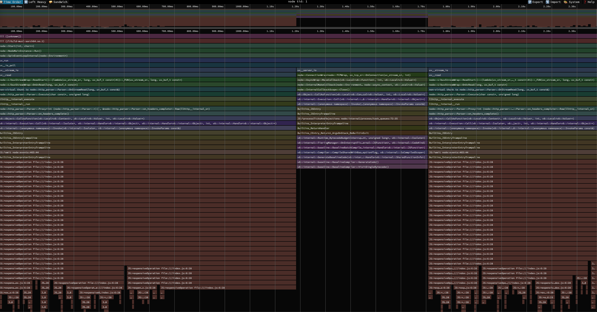

# Usign linux perf on a Node.js Docker image

## Pre-reqs

For running `docker` *without* Docker-for-Mac, I typically prefer to run `colima` (https://github.com/abiosoft/colima).

- `brew install colima`
- `brew install docker`
- `colima start` 

## Running the image

### Build the image
- `docker build -t node-perf-demo .` 

### Run the image and exec into the shell
- `docker run -d --name perf-demo-container --privileged -p 8080:8080 node-perf-demo`
    - note: `--privileged`: Required for `perf` to function properly, as it needs access to the host kernel. Don't do this in prod.
- `docker exec -it perf-demo-container sh`

### Exploring the Node.js Process

#### Basic perf stat
- `ps aux | grep node` 
- `perf stat -p ${NODE_PROCESS_ID}`

#### (Optional: Run some load)

Attach to `perf` in one terminal. Next, open a new terminal and fire some requests. In this example it's a GET request to `/example`.
- `curl -v http://localhost:8080/example`

Now kill the `perf stat` command and you should see some output like below.

```
 Performance counter stats for process id '1':

           1376.34 msec task-clock                       #    0.177 CPUs utilized             
                12      context-switches                 #    8.719 /sec                      
                 2      cpu-migrations                   #    1.453 /sec                      
                26      page-faults                      #   18.891 /sec                      
   <not supported>      cycles                                                                
   <not supported>      instructions                                                          
   <not supported>      branches                                                              
   <not supported>      branch-misses                                                         

       7.756294029 seconds time elapsed
```

#### Basic perf record

- `perf record -F99 -p "$(pgrep -n node)" -g -- sleep 30`
    - note: this will create a `perf.data` file, which you can convert with the builtin perf.data parser.

At this stage, you can fire some requests to see what info we can gather.
- `curl -v http://localhost:8080/example`

- `perf script > perf.data.txt`

To get a sample of what the output looks like.
- `head -20 perf.data.txt`

```
node       1  2078.820408:   10101010 cpu-clock:ppp: 
            f3d461a13bcc JS:*expensiveOperation file:///index.js:6:28+0x2c (/tmp/perf-1.map)
            f3d461a13c83 JS:*expensiveOperation file:///index.js:6:28+0xe3 (/tmp/perf-1.map)
            f3d461a13c84 JS:*expensiveOperation file:///index.js:6:28+0xe4 (/tmp/perf-1.map)
            f3d461a13c3c JS:*expensiveOperation file:///index.js:6:28+0x9c (/tmp/perf-1.map)
            f3d461a13c84 JS:*expensiveOperation file:///index.js:6:28+0xe4 (/tmp/perf-1.map)
            f3d461a13c3c JS:*expensiveOperation file:///index.js:6:28+0x9c (/tmp/perf-1.map)
            f3d461a13c84 JS:*expensiveOperation file:///index.js:6:28+0xe4 (/tmp/perf-1.map)
            f3d461a13c3c JS:*expensiveOperation file:///index.js:6:28+0x9c (/tmp/perf-1.map)
            f3d461a13c84 JS:*expensiveOperation file:///index.js:6:28+0xe4 (/tmp/perf-1.map)
            f3d461a13c3c JS:*expensiveOperation file:///index.js:6:28+0x9c (/tmp/perf-1.map)
            f3d461a13c84 JS:*expensiveOperation file:///index.js:6:28+0xe4 (/tmp/perf-1.map)
            f3d461a13c3c JS:*expensiveOperation file:///index.js:6:28+0x9c (/tmp/perf-1.map)
            f3d461a13c84 JS:*expensiveOperation file:///index.js:6:28+0xe4 (/tmp/perf-1.map)
            f3d461a13c3c JS:*expensiveOperation file:///index.js:6:28+0x9c (/tmp/perf-1.map)
            c2b24f719ef0 Builtins_InterpreterEntryTrampoline+0x110 (/usr/local/bin/node)
            f3d461a150e0 JS:^emit node:events:465:44+0x760 (/tmp/perf-1.map)
            c2b24f719ef0 Builtins_InterpreterEntryTrampoline+0x110 (/usr/local/bin/node)
            c2b24f717c0c Builtins_JSEntryTrampoline+0xac (/usr/local/bin/node)
            c2b24f7178f4 Builtins_JSEntry+0x94 (/usr/local/bin/node)
            c2b24ed596c0 v8::internal::(anonymous namespace)::Invoke(v8::internal::Isolate*, v8::internal::(anonymous namespace)::InvokeParams const&)+0x120 (/usr/local/bin/node)
            c2b24ed5a3e4 v8::internal::Execution::Call(v8::internal::Isolate*, v8::internal::Handle<v8::internal::Object>, v8::internal::Handle<v8::internal::Object>, int, v8::internal::Handle<v8::internal::Object>*)+0x64 (/usr/local/bin/node)
            c2b24ebfb964 v8::Object::CallAsFunction(v8::Local<v8::Context>, v8::Local<v8::Value>, int, v8::Local<v8::Value>*)+0x164 (/usr/local/bin/node)
            c2b24e937d58 node::http_parser::Parser::on_headers_complete()+0x4a8 (/usr/local/bin/node)
            c2b24e937fd0 node::http_parser::Parser::Proxy<int (node::http_parser::Parser::*)(), &node::http_parser::Parser::on_headers_complete>::Raw(llhttp__internal_s*)+0x20 (/usr/local/bin/node)
            c2b24fd25010 llhttp__internal__run+0x4030 (/usr/local/bin/node)
            c2b24fd26c4c llhttp__internal_execute+0x38 (/usr/local/bin/node)
            c2b24e9380a0 node::http_parser::Parser::Execute(char const*, unsigned long)+0x80 (/usr/local/bin/node)
            c2b24e9387fc non-virtual thunk to node::http_parser::Parser::OnStreamRead(long, uv_buf_t const&)+0xcc (/usr/local/bin/node)
```

### Visualising the data

Looking at terminal output is not ideal, so I would then typically export this data from the docker container into a tool like Speedscope (https://www.speedscope.app/). Ofc there are plenty of other options out there.

#### Extract the data

First we need to grab the perf.dat file from the container.

- `docker cp perf-demo-container:perf.data.txt .`

Then it's just a matter of importing that file into Speedscope to actually see what's going on.

 